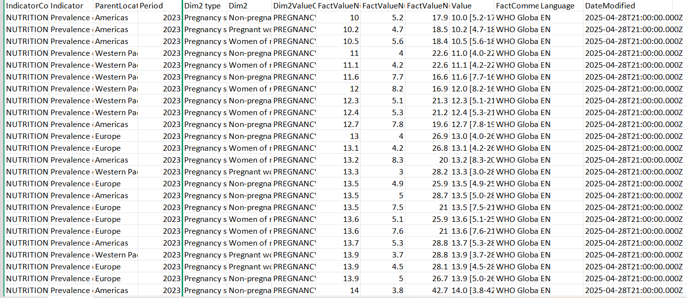
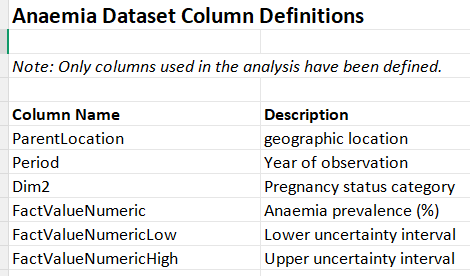

## 📊 Data Availability

The dataset contains approximately 13,000+ observations.

Due to size constraints, only a preview is included in this repository.

Data preview:

The full dataset is publicly available at:
https://www.who.int/data/gho/data/indicators/indicator-details/GHO/prevalence-of-anaemia-in-pregnant-women-(-)

Column definitions:

